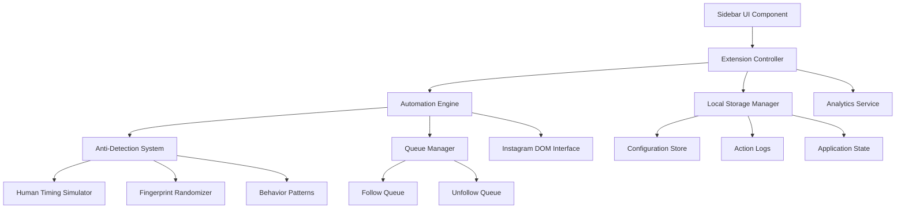

# Design Document

## Overview

The Instagram Follow/Unfollow Chrome Extension is a standalone browser extension that automates Instagram engagement operations while implementing sophisticated anti-detection mechanisms. The system uses a modular architecture with separate components for user interface, automation engine, anti-detection systems, and data management.

## Architecture

### High-Level Architecture



### Extension Structure

The extension follows Chrome Extension Manifest V3 architecture:

- **Content Script**: Injected into Instagram pages, handles DOM manipulation and user interface
- **Background Service Worker**: Manages extension lifecycle, storage, and cross-tab communication
- **Popup Interface**: Optional popup for quick settings and status overview
- **Options Page**: Comprehensive settings and configuration interface

## Components and Interfaces

### 1. User Interface Layer

#### Sidebar Component (`SidebarUI`)
- **Purpose**: Primary user interface displayed as an overlay on Instagram pages
- **Key Features**:
  - File upload interface for CSV/TXT files
  - Real-time progress indicators
  - Configuration panels for daily limits and timing
  - Emergency stop controls
  - Status dashboard with analytics

#### Configuration Interface (`ConfigUI`)
- **Purpose**: Advanced settings and campaign management
- **Key Features**:
  - Progressive daily limit configuration
  - Anti-detection behavior settings
  - Unfollow timing and conditions
  - Export/import configuration profiles

### 2. Automation Engine

#### Core Automation Controller (`AutomationController`)
```typescript
interface AutomationController {
  start(): Promise<void>;
  stop(): Promise<void>;
  pause(): Promise<void>;
  resume(): Promise<void>;
  getStatus(): AutomationStatus;
  processNextAction(): Promise<ActionResult>;
}

interface AutomationStatus {
  isRunning: boolean;
  currentAction: string;
  dailyProgress: DailyProgress;
  queueStatus: QueueStatus;
  nextActionTime: Date;
}
```

#### Instagram DOM Interface (`InstagramInterface`)
- **Purpose**: Handles all Instagram-specific DOM interactions
- **Key Methods**:
  - `searchAccount(username: string): Promise<boolean>`
  - `followAccount(): Promise<FollowResult>`
  - `unfollowAccount(): Promise<UnfollowResult>`
  - `navigateToProfile(username: string): Promise<boolean>`
  - `checkIfFollowing(username: string): Promise<boolean>`

### 3. Anti-Detection System

#### Human Behavior Simulator (`HumanBehaviorSimulator`)
```typescript
interface HumanBehaviorSimulator {
  simulateTyping(text: string, element: HTMLElement): Promise<void>;
  simulateMouseMovement(target: HTMLElement): Promise<void>;
  generateRandomDelay(min: number, max: number): Promise<void>;
  simulateScrolling(): Promise<void>;
  simulateProfileBrowsing(): Promise<void>;
  simulateTypingErrors(text: string): string;
  simulateNaturalBreaks(): Promise<void>;
  simulateContextualBrowsing(): Promise<void>;
  generateVariableTypingSpeed(): number;
  simulateIdleMouseMovements(): Promise<void>;
  simulateUnpredictableBehavior(): Promise<void>;
}

interface TypingBehavior {
  baseSpeed: number; // 80-200ms per character
  errorRate: number; // 3-7% for usernames
  correctionDelay: number; // 150-450ms to notice and fix errors
  pauseProbability: number; // 10% micro-pauses, 5% longer hesitations
  microPauseRange: [number, number]; // 50-250ms
  hesitationRange: [number, number]; // 300-1100ms
}

interface MouseBehavior {
  detourProbability: number; // 30% chance for indirect routes
  hoverJitterProbability: number; // 20% chance for hover movements
  idleMovementProbability: number; // 15% chance during idle time
  speedRange: [number, number]; // 8-25ms between movement points
  maxWaypoints: number; // 1-3 random waypoints for detours
  jitterRadius: number; // ±20px for hover jitter
  curveIntensity: number; // How curved the mouse paths are
}
```

#### Anti-Detect Browser Integration (`BrowserIntegration`)
- **Purpose**: Leverage anti-detect browser capabilities for fingerprint protection
- **Features**:
  - **Browser-Level Protection**: Rely on anti-detect browser for fingerprint randomization
  - **Session Management**: Work with browser's session isolation features
  - **Proxy Integration**: Utilize browser's proxy rotation if configured
  - **Canvas/WebGL Protection**: Browser handles canvas fingerprint protection

#### Rate Limit Handler (`RateLimitHandler`)
- **Purpose**: Detects and responds to Instagram rate limiting
- **Features**:
  - Exponential backoff implementation
  - Intelligent cooldown periods
  - Rate limit pattern recognition
  - Automatic retry scheduling

### 4. Queue Management System

#### Queue Manager (`QueueManager`)
```typescript
interface QueueManager {
  addToFollowQueue(accounts: string[]): void;
  addToUnfollowQueue(accounts: AccountRecord[]): void;
  getNextFollowAction(): Promise<QueueAction | null>;
  getNextUnfollowAction(): Promise<QueueAction | null>;
  updateActionStatus(actionId: string, status: ActionStatus): void;
  clearQueue(queueType: QueueType): void;
}

interface QueueAction {
  id: string;
  type: 'follow' | 'unfollow';
  username: string;
  scheduledTime: Date;
  attempts: number;
  priority: number;
}
```

#### Daily Limit Manager (`DailyLimitManager`)
- **Purpose**: Enforces progressive daily limits and scheduling based on 2025 Instagram policies
- **Features**:
  - **Account Age-Based Limits**: Different limits for new vs established accounts
  - **Progressive Scaling**: Gradual increase from conservative to normal limits
  - **Time Distribution**: Spread actions over 8-12 hours, not concentrated bursts
  - **Hourly Rate Limiting**: Enforce maximum actions per hour (10 follows, 60 unfollows)
  - **Cooldown Periods**: Mandatory breaks between action batches
  - **Weekend/Holiday Patterns**: Reduced activity during typical low-usage periods

```typescript
interface DailyLimitConfig {
  accountAge: 'new' | 'established'; // < 30 days vs > 30 days
  maxFollowsPerDay: number; // 100 for new, 200 for established
  maxUnfollowsPerDay: number; // Similar limits
  maxFollowsPerHour: number; // 10 max
  maxUnfollowsPerHour: number; // 60 max
  minActionInterval: number; // 30-45s for new accounts
  mandatoryBreakAfter: number; // Actions before break required
  breakDuration: { min: number; max: number }; // 10-30 minutes
}
```

### 5. Data Management

#### Storage Manager (`StorageManager`)
```typescript
interface StorageManager {
  saveConfiguration(config: ExtensionConfig): Promise<void>;
  loadConfiguration(): Promise<ExtensionConfig>;
  logAction(action: ActionLog): Promise<void>;
  getActionHistory(dateRange: DateRange): Promise<ActionLog[]>;
  exportLogs(format: 'csv' | 'json'): Promise<string>;
  clearOldLogs(retentionDays: number): Promise<void>;
}

interface ActionLog {
  id: string;
  timestamp: Date;
  action: 'follow' | 'unfollow';
  username: string;
  success: boolean;
  error?: string;
  responseTime: number;
}
```

#### Analytics Service (`AnalyticsService`)
- **Purpose**: Processes and analyzes automation performance
- **Features**:
  - Success rate calculations
  - Performance trend analysis
  - Error pattern detection
  - Daily/weekly/monthly reporting

## Data Models

### Configuration Model
```typescript
interface ExtensionConfig {
  dailyLimits: DailyLimitConfig[];
  unfollowSettings: UnfollowConfig;
  antiDetection: AntiDetectionConfig;
  general: GeneralConfig;
}

interface DailyLimitConfig {
  day: number;
  followLimit: number;
  unfollowLimit: number;
  enabled: boolean;
}

interface UnfollowConfig {
  enabled: boolean;
  delayDays: number;
  skipFollowBacks: boolean;
  maxUnfollowsPerDay: number;
}

interface AntiDetectionConfig {
  typingSpeed: { min: number; max: number };
  actionDelays: { min: number; max: number };
  enableProfileBrowsing: boolean;
  randomizeFingerprints: boolean;
  respectRateLimits: boolean;
}
```

### Account Management Model
```typescript
interface AccountRecord {
  username: string;
  followedAt?: Date;
  unfollowedAt?: Date;
  followsBack: boolean;
  status: 'pending' | 'followed' | 'unfollowed' | 'error';
  attempts: number;
  lastError?: string;
}

interface QueueState {
  followQueue: QueueAction[];
  unfollowQueue: QueueAction[];
  processing: boolean;
  lastProcessedAt: Date;
  dailyStats: DailyStats;
}
```

## Error Handling

### Error Categories
1. **Network Errors**: Connection issues, timeouts, Instagram API changes
2. **Rate Limit Errors**: Instagram blocking or throttling requests
3. **DOM Errors**: Selector changes, page structure modifications
4. **User Errors**: Invalid account names, configuration issues
5. **Storage Errors**: Chrome storage quota, permission issues
6. **Detection Errors**: CAPTCHA challenges, verification prompts, suspicious activity warnings
7. **Account Errors**: Account restrictions, temporary blocks, login issues

### Error Recovery Strategies
- **Automatic Retry**: Exponential backoff for transient errors (1min → 5min → 15min → 1hr)
- **Graceful Degradation**: Continue operation with reduced functionality
- **User Notification**: Clear error messages with suggested actions
- **Fallback Mechanisms**: Alternative selectors and interaction methods
- **Safe Mode**: Reduced speed operation when errors are frequent
- **Detection Response**: Immediate stop for CAPTCHAs, verification prompts, or blocks
- **Extended Cooldowns**: 24-48 hour pauses after detection signals
- **Manual Override Required**: User confirmation needed to resume after blocks

### Error Logging
```typescript
interface ErrorLog {
  timestamp: Date;
  category: ErrorCategory;
  severity: 'low' | 'medium' | 'high' | 'critical';
  message: string;
  context: any;
  stackTrace?: string;
  userAction?: string;
}
```

## Testing Strategy

### Unit Testing
- **Component Testing**: Individual UI components and their interactions
- **Service Testing**: Automation engine, queue manager, and storage services
- **Utility Testing**: Anti-detection algorithms and helper functions

### Integration Testing
- **DOM Integration**: Testing Instagram page interactions with mock DOM
- **Storage Integration**: Chrome storage API integration testing
- **Cross-Component**: Testing communication between extension components

### End-to-End Testing
- **Automation Flows**: Complete follow/unfollow cycles in test environment
- **Error Scenarios**: Testing error handling and recovery mechanisms
- **Performance Testing**: Memory usage, CPU impact, and response times

### Manual Testing
- **Instagram Compatibility**: Testing across different Instagram layouts
- **Browser Compatibility**: Chrome, Edge, and other Chromium-based browsers
- **Anti-Detection Validation**: Monitoring for detection patterns

## 2025 Anti-Detection Enhancements

### Instagram Rate Limits (2025 Guidelines)
- **Established Accounts**: Maximum 150-200 follows per day, spread over 8-12 hours (~10 per hour)
- **New Accounts**: Maximum 100 follows per day with 30-45 seconds between actions for first few weeks
- **Unfollow Limits**: Maximum 200 per day, ~60 per hour
- **Account Warmup**: Gradually increase activity over time, starting with very conservative limits

### Advanced Human Behavior Simulation
- **Extended Browsing Context**: Simulate profile viewing, scrolling, and content engagement before following
- **Natural Break Patterns**: Implement 10-30 minute breaks after every N actions
- **Time Distribution**: Spread activity across different hours, avoid 24/7 operation patterns
- **Follow-Unfollow Separation**: Enforce minimum days between following and unfollowing same account

### Enhanced Detection Avoidance
- **Anti-Detect Browser Synergy**: Leverage browser's built-in fingerprint protection
- **Behavioral Focus**: Concentrate on human-like interaction patterns rather than fingerprints
- **DOM Interaction Realism**: Use actual click events with proper event propagation
- **CAPTCHA Handling**: Immediate stop and user notification for verification challenges

### Behavioral Pattern Diversification
- **Action Sequence Randomization**: Avoid predictable follow/unfollow patterns
- **Contextual Engagement**: Occasionally view stories, posts, or profiles without action
- **Schedule Variation**: Different daily timing patterns to avoid routine detection
- **Emergency Protocols**: Automatic shutdown on detection signals

## Security Considerations

### Data Privacy
- **Local Storage Only**: No data transmitted to external servers
- **Encrypted Storage**: Sensitive configuration data encryption
- **User Consent**: Clear disclosure of data collection and usage

### Instagram Compliance
- **Rate Limiting**: Respect Instagram's 2025 usage policies and limits
- **Web UI Only**: Use only public web interface, no private APIs or direct HTTP requests
- **Account Safety**: Implement safeguards to prevent account suspension
- **Terms Compliance**: Operate within Instagram's acceptable use guidelines
- **Anti-Detect Browser Synergy**: Work with browser's protection features without interference

### Extension Security
- **Content Security Policy**: Strict CSP to prevent XSS attacks
- **Permission Minimization**: Request only necessary Chrome permissions (activeTab, storage)
- **Code Obfuscation**: Protect behavioral simulation algorithms from analysis
- **Manifest V3**: Use latest Chrome extension architecture for security
- **Browser Compatibility**: Ensure compatibility with anti-detect browser modifications

## 2025 Instagram Detection Countermeasures

### Current Detection Methods
Instagram's 2025 anti-bot systems analyze:
- **Behavioral Patterns**: Consistent timing, predictable sequences, lack of variation
- **Interaction Quality**: Missing mouse movements, perfect typing, no browsing context
- **Volume Analysis**: Exceeding daily/hourly limits, concentrated activity bursts
- **Account Fingerprinting**: Browser characteristics, request patterns, session data

### Anti-Detect Browser Context
Since this extension runs within an anti-detect browser:
- **Fingerprint Protection**: Browser handles user agent, canvas, WebGL, and other fingerprint randomization
- **Request Headers**: Browser manages header randomization and TLS fingerprints
- **Session Isolation**: Browser provides clean session management
- **Extension Focus**: We focus on behavioral simulation rather than browser-level detection

### Countermeasure Implementation

#### Typing Simulation Enhancement
```typescript
class AdvancedTypingSimulator {
  private generateRealisticTyping(text: string): TypingSequence {
    const sequence: TypingSequence = [];
    const baseSpeed = 80 + Math.random() * 120; // 80-200ms
    
    for (let i = 0; i < text.length; i++) {
      // Variable speed per character with more randomness
      const charDelay = baseSpeed + (Math.random() - 0.5) * 80;
      
      // Occasional typos (3-7% chance for usernames)
      if (Math.random() < 0.05) {
        const wrongChar = this.getRandomWrongChar(text[i]);
        sequence.push({ char: wrongChar, delay: charDelay });
        sequence.push({ action: 'backspace', delay: 150 + Math.random() * 300 });
        sequence.push({ char: text[i], delay: charDelay * 1.3 });
      } else {
        sequence.push({ char: text[i], delay: charDelay });
      }
      
      // Random micro-pauses during typing (10% chance)
      if (Math.random() < 0.1) {
        sequence.push({ action: 'pause', delay: 50 + Math.random() * 200 });
      }
      
      // Longer hesitation pauses (5% chance)
      if (Math.random() < 0.05) {
        sequence.push({ action: 'pause', delay: 300 + Math.random() * 800 });
      }
    }
    
    return sequence;
  }
  
  private getRandomWrongChar(correctChar: string): string {
    // Common typos for username characters
    const typoMap: { [key: string]: string[] } = {
      'a': ['s', 'q', 'w'],
      'e': ['r', 'w', 'd'],
      'i': ['o', 'u', 'k'],
      'o': ['p', 'i', 'l'],
      'u': ['y', 'i', 'j'],
      's': ['a', 'd', 'w'],
      'd': ['s', 'f', 'e'],
      'f': ['d', 'g', 'r'],
      'g': ['f', 'h', 't'],
      'h': ['g', 'j', 'y'],
      'j': ['h', 'k', 'u'],
      'k': ['j', 'l', 'i'],
      'l': ['k', 'o', 'p']
    };
    
    const possibleTypos = typoMap[correctChar.toLowerCase()];
    if (possibleTypos && possibleTypos.length > 0) {
      return possibleTypos[Math.floor(Math.random() * possibleTypos.length)];
    }
    
    // Fallback: random adjacent character
    const alphabet = 'abcdefghijklmnopqrstuvwxyz';
    return alphabet[Math.floor(Math.random() * alphabet.length)];
  }
}
```

#### Advanced Mouse Movement Simulation
```typescript
class MouseMovementSimulator {
  async navigateToElement(targetElement: HTMLElement): Promise<void> {
    const currentPos = this.getCurrentMousePosition();
    const targetRect = targetElement.getBoundingClientRect();
    const targetPos = this.getRandomPointInElement(targetRect);
    
    // 30% chance to take a detour route
    if (Math.random() < 0.3) {
      await this.executeDetourMovement(currentPos, targetPos);
    } else {
      await this.executeDirectMovement(currentPos, targetPos);
    }
    
    // Random hover time before clicking
    await this.randomDelay(100, 800);
    
    // 20% chance for random movement during hover
    if (Math.random() < 0.2) {
      await this.simulateHoverJitter(targetPos);
    }
  }
  
  private async executeDetourMovement(start: Point, end: Point): Promise<void> {
    // Generate 1-3 random waypoints
    const numWaypoints = 1 + Math.floor(Math.random() * 3);
    const waypoints: Point[] = [];
    
    for (let i = 0; i < numWaypoints; i++) {
      waypoints.push({
        x: Math.random() * window.innerWidth,
        y: Math.random() * window.innerHeight
      });
    }
    
    // Move through waypoints
    let currentPos = start;
    for (const waypoint of waypoints) {
      const path = this.generateNaturalPath(currentPos, waypoint);
      await this.executeMousePath(path, this.getRandomSpeed());
      
      // Random hover at waypoint
      await this.randomDelay(50, 300);
      currentPos = waypoint;
    }
    
    // Final movement to target
    const finalPath = this.generateNaturalPath(currentPos, end);
    await this.executeMousePath(finalPath, this.getRandomSpeed());
  }
  
  private async executeDirectMovement(start: Point, end: Point): Promise<void> {
    // Even "direct" movement has curves and variations
    const path = this.generateNaturalPath(start, end);
    await this.executeMousePath(path, this.getRandomSpeed());
  }
  
  private generateNaturalPath(start: Point, end: Point): Point[] {
    const distance = Math.sqrt(Math.pow(end.x - start.x, 2) + Math.pow(end.y - start.y, 2));
    const numPoints = Math.max(10, Math.floor(distance / 20));
    
    // Generate control points for natural curve
    const midX = (start.x + end.x) / 2;
    const midY = (start.y + end.y) / 2;
    
    // Add randomness to curve
    const curveOffset = (Math.random() - 0.5) * Math.min(200, distance * 0.3);
    const controlPoint = {
      x: midX + curveOffset,
      y: midY + (Math.random() - 0.5) * Math.min(150, distance * 0.2)
    };
    
    const path: Point[] = [];
    for (let i = 0; i <= numPoints; i++) {
      const t = i / numPoints;
      const point = this.quadraticBezier(start, controlPoint, end, t);
      
      // Add micro-jitter to each point
      point.x += (Math.random() - 0.5) * 4;
      point.y += (Math.random() - 0.5) * 4;
      
      path.push(point);
    }
    
    return path;
  }
  
  private async executeMousePath(path: Point[], baseSpeed: number): Promise<void> {
    for (let i = 0; i < path.length; i++) {
      const point = path[i];
      
      // Variable speed - slower at start/end, faster in middle
      const speedMultiplier = this.getSpeedMultiplier(i, path.length);
      const delay = baseSpeed * speedMultiplier + (Math.random() - 0.5) * 5;
      
      // Move mouse to point
      this.setMousePosition(point);
      
      // Random micro-pauses during movement (5% chance)
      if (Math.random() < 0.05) {
        await this.randomDelay(10, 50);
      }
      
      await new Promise(resolve => setTimeout(resolve, Math.max(1, delay)));
    }
  }
  
  private getRandomSpeed(): number {
    // Generous speed variation: 8-25ms between points
    return 8 + Math.random() * 17;
  }
  
  private getSpeedMultiplier(index: number, totalPoints: number): number {
    const progress = index / totalPoints;
    // Slower at start and end, faster in middle
    return 0.5 + 0.5 * Math.sin(progress * Math.PI);
  }
  
  private async simulateHoverJitter(centerPoint: Point): Promise<void> {
    const jitterMoves = 2 + Math.floor(Math.random() * 4);
    
    for (let i = 0; i < jitterMoves; i++) {
      const jitterPoint = {
        x: centerPoint.x + (Math.random() - 0.5) * 20,
        y: centerPoint.y + (Math.random() - 0.5) * 20
      };
      
      this.setMousePosition(jitterPoint);
      await this.randomDelay(50, 200);
    }
    
    // Return to center
    this.setMousePosition(centerPoint);
  }
  
  private getRandomPointInElement(rect: DOMRect): Point {
    // Don't always click center - add randomness within element bounds
    const padding = 5;
    return {
      x: rect.left + padding + Math.random() * (rect.width - padding * 2),
      y: rect.top + padding + Math.random() * (rect.height - padding * 2)
    };
  }
  
  private quadraticBezier(p0: Point, p1: Point, p2: Point, t: number): Point {
    const x = Math.pow(1 - t, 2) * p0.x + 2 * (1 - t) * t * p1.x + Math.pow(t, 2) * p2.x;
    const y = Math.pow(1 - t, 2) * p0.y + 2 * (1 - t) * t * p1.y + Math.pow(t, 2) * p2.y;
    return { x, y };
  }
  
  // Random unpredictable movements during idle time
  async simulateIdleMovements(): Promise<void> {
    if (Math.random() < 0.15) { // 15% chance during idle
      const randomPoint = {
        x: Math.random() * window.innerWidth,
        y: Math.random() * window.innerHeight
      };
      
      const currentPos = this.getCurrentMousePosition();
      const path = this.generateNaturalPath(currentPos, randomPoint);
      await this.executeMousePath(path, this.getRandomSpeed());
      
      // Hover at random location
      await this.randomDelay(200, 1000);
    }
  }
}

interface Point {
  x: number;
  y: number;
}
```

#### Contextual Browsing Simulation
```typescript
class ContextualBrowsingSimulator {
  async simulateProfileVisit(username: string): Promise<void> {
    // Navigate to profile
    await this.navigateToProfile(username);
    
    // Random viewing behavior
    const actions = [
      () => this.scrollProfile(Math.random() * 500 + 200),
      () => this.viewRandomPost(),
      () => this.checkFollowerCount(),
      () => this.readBio(),
      () => this.viewStories()
    ];
    
    // Perform 1-3 random actions
    const numActions = 1 + Math.floor(Math.random() * 3);
    for (let i = 0; i < numActions; i++) {
      const action = actions[Math.floor(Math.random() * actions.length)];
      await action();
      await this.randomDelay(1000, 3000);
    }
  }
}
```

### Activity Distribution Strategy
- **Time Spreading**: Actions distributed over 8-12 hours daily
- **Natural Breaks**: 10-30 minute pauses every 10-20 actions
- **Weekly Patterns**: Reduced activity on weekends, varied daily schedules
- **Seasonal Adjustments**: Account for holidays and typical usage patterns

### Unpredictable Behavior Patterns
```typescript
class UnpredictableBehaviorSimulator {
  async executeRandomBehavior(): Promise<void> {
    const behaviors = [
      () => this.randomMouseWander(),
      () => this.simulateDistraction(),
      () => this.randomScrolling(),
      () => this.simulateReadingPause(),
      () => this.randomPageInteraction()
    ];
    
    // 25% chance of random behavior during any action
    if (Math.random() < 0.25) {
      const behavior = behaviors[Math.floor(Math.random() * behaviors.length)];
      await behavior();
    }
  }
  
  private async randomMouseWander(): Promise<void> {
    // Move mouse to random locations without clicking
    const wanderCount = 1 + Math.floor(Math.random() * 3);
    
    for (let i = 0; i < wanderCount; i++) {
      const randomPoint = {
        x: Math.random() * window.innerWidth,
        y: Math.random() * window.innerHeight
      };
      
      await this.mouseSimulator.navigateToPoint(randomPoint);
      await this.randomDelay(200, 1500);
    }
  }
  
  private async simulateDistraction(): Promise<void> {
    // Simulate user getting distracted - longer pause with mouse movement
    await this.randomDelay(2000, 8000);
    
    // Maybe move mouse during distraction
    if (Math.random() < 0.6) {
      await this.randomMouseWander();
    }
  }
  
  private async randomScrolling(): Promise<void> {
    // Random scrolling up/down
    const scrollDirection = Math.random() < 0.5 ? -1 : 1;
    const scrollAmount = 100 + Math.random() * 400;
    
    window.scrollBy(0, scrollDirection * scrollAmount);
    await this.randomDelay(500, 2000);
    
    // Sometimes scroll back
    if (Math.random() < 0.4) {
      window.scrollBy(0, -scrollDirection * scrollAmount * 0.7);
      await this.randomDelay(300, 1000);
    }
  }
  
  private async simulateReadingPause(): Promise<void> {
    // Simulate reading something on screen
    const readingTime = 1000 + Math.random() * 4000;
    
    // Small mouse movements during reading
    const startTime = Date.now();
    while (Date.now() - startTime < readingTime) {
      if (Math.random() < 0.3) {
        const currentPos = this.mouseSimulator.getCurrentPosition();
        const smallMovement = {
          x: currentPos.x + (Math.random() - 0.5) * 50,
          y: currentPos.y + (Math.random() - 0.5) * 30
        };
        
        await this.mouseSimulator.navigateToPoint(smallMovement);
      }
      
      await this.randomDelay(200, 800);
    }
  }
  
  private async randomPageInteraction(): Promise<void> {
    // Interact with random page elements (hover, not click)
    const elements = document.querySelectorAll('a, button, img, div[role="button"]');
    if (elements.length > 0) {
      const randomElement = elements[Math.floor(Math.random() * elements.length)] as HTMLElement;
      
      await this.mouseSimulator.navigateToElement(randomElement);
      await this.randomDelay(300, 1200);
      
      // Move away without clicking
      const awayPoint = {
        x: Math.random() * window.innerWidth,
        y: Math.random() * window.innerHeight
      };
      await this.mouseSimulator.navigateToPoint(awayPoint);
    }
  }
}
```

## Performance Optimization

### Memory Management
- **Efficient Storage**: Minimize memory footprint for large account lists
- **Garbage Collection**: Proper cleanup of DOM references and timers
- **Background Processing**: Offload heavy operations to service worker

### CPU Optimization
- **Lazy Loading**: Load components and data only when needed
- **Debounced Operations**: Prevent excessive DOM queries and updates
- **Efficient Algorithms**: Optimized queue processing and scheduling

### Network Efficiency
- **Request Batching**: Minimize Instagram page requests
- **Caching**: Cache DOM selectors and page structure information
- **Connection Reuse**: Maintain persistent connections where possible

## Anti-Detect Browser Integration

### Browser Environment Assumptions
- **Fingerprint Protection**: Anti-detect browser handles user agent, canvas, WebGL, and audio fingerprints
- **Proxy Management**: Browser may rotate IP addresses and manage proxy connections
- **Session Isolation**: Each browser profile provides clean session management
- **Header Randomization**: Browser manages HTTP header patterns and TLS fingerprints

### Extension Responsibilities vs Browser Responsibilities

#### Extension Handles:
- **Behavioral Simulation**: Human-like typing, mouse movements, timing patterns
- **Action Sequencing**: Follow/unfollow workflow and queue management
- **Rate Limiting**: Respect Instagram's daily/hourly limits
- **Content Interaction**: Profile browsing, scrolling, contextual behavior
- **Error Handling**: CAPTCHA detection, rate limit responses, graceful failures

#### Anti-Detect Browser Handles:
- **Browser Fingerprinting**: User agent, screen resolution, timezone, language
- **Canvas/WebGL Protection**: Fingerprint randomization for graphics APIs
- **Network Fingerprinting**: TLS fingerprints, HTTP/2 settings, connection patterns
- **Plugin/Extension Detection**: Hiding extension presence from websites
- **Cookie/Storage Management**: Session isolation and tracking prevention

### Integration Considerations
- **No Conflicting Randomization**: Extension avoids duplicating browser's fingerprint protection
- **Behavioral Focus**: Extension concentrates on interaction patterns rather than technical fingerprints
- **Browser API Usage**: Use standard Chrome extension APIs without interfering with browser modifications
- **Profile Compatibility**: Ensure extension works across different anti-detect browser profiles

### Configuration Recommendations
- **Browser Settings**: Recommend specific anti-detect browser configurations for Instagram
- **Profile Management**: Guidance on creating dedicated profiles for Instagram automation
- **Proxy Integration**: How to coordinate with browser's proxy rotation features
- **Session Management**: Best practices for maintaining consistent sessions

## Deployment and Distribution

### Build Process
- **Webpack Configuration**: Bundle extension files for production
- **Code Minification**: Reduce extension size and improve loading
- **Asset Optimization**: Compress images and optimize resources

### Chrome Web Store
- **Extension Manifest**: Proper permissions and metadata configuration
- **Store Listing**: Clear description of functionality and limitations
- **Review Compliance**: Ensure adherence to Chrome Web Store policies

### Update Mechanism
- **Automatic Updates**: Chrome's built-in extension update system
- **Configuration Migration**: Handle settings migration between versions
- **Backward Compatibility**: Maintain compatibility with existing user data