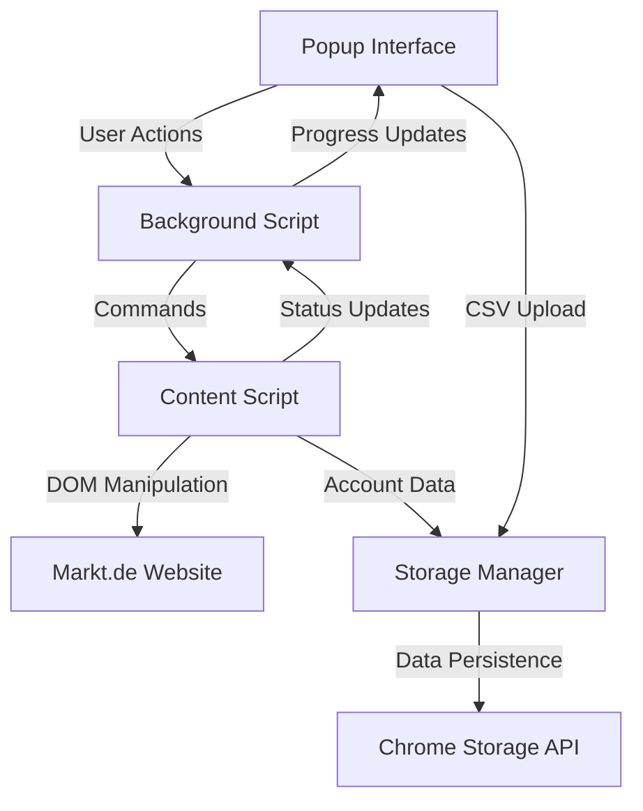

# Design Document

## Overview

The markt.de Chrome Extension DM Bot will be a browser extension that automates direct messaging campaigns on markt.de. The extension will convert the existing Playwright-based Node.js bot into a Chrome extension architecture using content scripts, background scripts, and a popup interface. The design leverages Chrome's extension APIs for storage, messaging, and DOM manipulation while maintaining the robust functionality of the original bot.

## Architecture

### Extension Structure
```
marktde-chrome-extension/
├── manifest.json                 # Extension configuration
├── background.js                 # Service worker for background tasks
├── popup/
│   ├── popup.html               # Main popup interface
│   ├── popup.js                 # Popup logic and UI controls
│   └── popup.css                # Popup styling
├── content/
│   ├── content-script.js        # Main content script injected into markt.de
│   ├── markt-interface.js       # Markt.de specific DOM interactions
│   ├── automation-engine.js     # Core automation logic
│   └── human-behavior.js        # Natural behavior simulation
├── utils/
│   ├── storage-manager.js       # Chrome storage API wrapper
│   ├── csv-parser.js            # CSV file processing utilities
│   └── logger.js                # Logging and statistics
└── icons/
    ├── icon16.png
    ├── icon48.png
    └── icon128.png
```

### Component Communication Flow


## Components and Interfaces

### 1. Manifest Configuration (manifest.json)
```json
{
  "manifest_version": 3,
  "name": "Markt.de DM Bot",
  "version": "1.0.0",
  "description": "Automated direct messaging for markt.de",
  "permissions": [
    "storage",
    "activeTab",
    "scripting"
  ],
  "host_permissions": [
    "https://*.markt.de/*"
  ],
  "background": {
    "service_worker": "background.js"
  },
  "content_scripts": [{
    "matches": ["https://*.markt.de/*"],
    "js": [
      "utils/logger.js",
      "utils/storage-manager.js", 
      "content/human-behavior.js",
      "content/markt-interface.js",
      "content/automation-engine.js",
      "content/content-script.js"
    ]
  }],
  "action": {
    "default_popup": "popup/popup.html",
    "default_icon": {
      "16": "icons/icon16.png",
      "48": "icons/icon48.png",
      "128": "icons/icon128.png"
    }
  }
}
```

### 2. Background Script (background.js)
**Purpose:** Service worker that manages extension lifecycle, coordinates between popup and content scripts, and handles persistent operations.

**Key Responsibilities:**
- Message routing between popup and content scripts
- Campaign state management
- Storage operations coordination
- Extension lifecycle management

**Interface:**
```javascript
class BackgroundService {
  // Message handling
  handleMessage(message, sender, sendResponse)
  
  // Campaign management
  startCampaign(config)
  stopCampaign()
  getCampaignStatus()
  
  // Storage coordination
  saveAccountData(accounts)
  loadAccountData()
  updateContactedAccounts(account, status)
}
```

### 3. Content Script System

#### 3.1 Main Content Script (content-script.js)
**Purpose:** Entry point for all content script functionality, coordinates other modules.

```javascript
class MarktDMContentScript {
  constructor()
  init()
  handleBackgroundMessage(message)
  startAutomation(config)
  stopAutomation()
}
```

#### 3.2 Markt Interface (markt-interface.js)
**Purpose:** Handles all markt.de specific DOM interactions and selectors.

```javascript
class MarktInterface {
  // Login functionality
  async login(email, password)
  async handleCookieConsent()
  async checkLoginStatus()
  
  // DM functionality  
  async navigateToProfile(profileUrl)
  async openDMDialog()
  async sendMessage(message)
  async closeDMDialog()
  
  // Utility methods
  async waitForElement(selector, timeout)
  async isElementVisible(selector)
  async getSessionCookies()
}
```

**Selectors Configuration:**
```javascript
const SELECTORS = {
  login: {
    emailInput: '#clsy-login-username',
    passwordInput: '#clsy-login-password', 
    rememberMeCheckbox: '#clsy-login-rememberme',
    loginButton: 'button[type="submit"]:has-text("Anmelden")'
  },
  dm: {
    dmButton: '.clsy-profile__toolbar-open-contact-dialog',
    dmTextarea: '#clsy-c-contactPopup-message',
    sendButton: '.clsy-c-contactPopup-submit'
  },
  cookieConsent: [
    'div[role="button"].cmp_button.cmp_button_bg.cmp_button_font_color.cmp-button-accept-all',
    'div.cmp-button-accept-all[role="button"]',
    '.cmp-button-accept-all',
    'div[role="button"]:has-text("AKZEPTIEREN UND WEITER")'
  ]
};
```

#### 3.3 Automation Engine (automation-engine.js)
**Purpose:** Core automation logic that orchestrates the DM campaign process.

```javascript
class AutomationEngine {
  constructor(marktInterface, humanBehavior, storageManager)
  
  // Campaign management
  async runCampaign(config)
  async processAccount(account)
  async sendDMToAccount(account)
  
  // Error handling and recovery
  async handleError(error, account)
  async retryOperation(operation, maxRetries)
  
  // Progress tracking
  updateProgress(stats)
  reportStatus(status)
}
```

#### 3.4 Human Behavior Simulation (human-behavior.js)
**Purpose:** Implements natural human-like interactions to avoid detection.

```javascript
class HumanBehavior {
  // Typing simulation
  async typeNaturally(element, text, options)
  
  // Click simulation
  async clickNaturally(element, options)
  
  // Delay management
  async randomDelay(min, max)
  async getTypingDelay()
  async getActionDelay()
  
  // Mouse movement simulation
  async simulateMouseMovement(element)
}
```

### 4. Popup Interface

#### 4.1 Popup HTML Structure (popup.html)
```html
<!DOCTYPE html>
<html>
<head>
  <link rel="stylesheet" href="popup.css">
</head>
<body>
  <div class="popup-container">
    <!-- Header -->
    <div class="header">
      <h2>Markt.de DM Bot</h2>
      <div class="status-indicator" id="statusIndicator"></div>
    </div>
    
    <!-- Login Section -->
    <div class="section" id="loginSection">
      <h3>Login Configuration</h3>
      <input type="email" id="emailInput" placeholder="Email">
      <input type="password" id="passwordInput" placeholder="Password">
      <button id="loginButton">Login to Markt.de</button>
    </div>
    
    <!-- Campaign Section -->
    <div class="section" id="campaignSection">
      <h3>Campaign Management</h3>
      <input type="file" id="csvUpload" accept=".csv">
      <div class="campaign-controls">
        <button id="startCampaign">Start Campaign</button>
        <button id="stopCampaign">Stop Campaign</button>
      </div>
    </div>
    
    <!-- Progress Section -->
    <div class="section" id="progressSection">
      <h3>Progress</h3>
      <div class="stats">
        <div class="stat">
          <span class="label">Processed:</span>
          <span id="processedCount">0</span>
        </div>
        <div class="stat">
          <span class="label">Successful:</span>
          <span id="successCount">0</span>
        </div>
        <div class="stat">
          <span class="label">Failed:</span>
          <span id="failedCount">0</span>
        </div>
      </div>
      <div class="progress-bar">
        <div class="progress-fill" id="progressFill"></div>
      </div>
    </div>
    
    <!-- Settings Section -->
    <div class="section" id="settingsSection">
      <h3>Settings</h3>
      <label>
        Max Accounts per Session:
        <input type="number" id="maxAccounts" value="50" min="1" max="100">
      </label>
      <label>
        Delay between accounts (seconds):
        <input type="number" id="accountDelay" value="5" min="3" max="30">
      </label>
      <textarea id="messageTemplate" placeholder="DM message template">Hey ich habe gesehen, dass du einer Freundin von mir auch folgst 🫣 Falls du mich auch ganz süß findestund mich kennenlerenen willst schreib mir doch auf Telegram @</textarea>
    </div>
    
    <!-- Logs Section -->
    <div class="section" id="logsSection">
      <h3>Recent Activity</h3>
      <div class="logs-container" id="logsContainer"></div>
      <button id="exportLogs">Export Logs</button>
    </div>
  </div>
  
  <script src="popup.js"></script>
</body>
</html>
```

#### 4.2 Popup Controller (popup.js)
```javascript
class PopupController {
  constructor()
  
  // UI Management
  async initializeUI()
  async updateStatus()
  async updateProgress(stats)
  async updateLogs(logs)
  
  // Event Handlers
  handleLogin()
  handleCampaignStart()
  handleCampaignStop()
  handleCSVUpload(file)
  handleSettingsChange()
  
  // Communication
  async sendMessageToBackground(message)
  async sendMessageToContentScript(message)
}
```

### 5. Utility Components

#### 5.1 Storage Manager (storage-manager.js)
**Purpose:** Manages all Chrome storage operations with proper error handling.

```javascript
class StorageManager {
  // Account data management
  async saveTargetAccounts(accounts)
  async loadTargetAccounts()
  async saveContactedAccounts(accounts)
  async loadContactedAccounts()
  async markAccountAsContacted(account, status, error)
  
  // Configuration management
  async saveConfig(config)
  async loadConfig()
  async saveCredentials(email, password)
  async loadCredentials()
  
  // Session management
  async saveSessionData(data)
  async loadSessionData()
  async clearSessionData()
  
  // Statistics
  async saveStats(stats)
  async loadStats()
  async updateStats(newStats)
}
```

#### 5.2 CSV Parser (csv-parser.js)
**Purpose:** Handles CSV file parsing and generation with proper escaping.

```javascript
class CSVParser {
  // Parsing
  static parseCSV(csvContent)
  static parseCSVLine(line)
  
  // Generation
  static generateCSV(data, headers)
  static sanitizeForCSV(text)
  
  // Validation
  static validateAccountsCSV(data)
  static validateCSVStructure(headers)
}
```

#### 5.3 Logger (logger.js)
**Purpose:** Centralized logging system with different log levels and persistence.

```javascript
class Logger {
  constructor(component)
  
  // Logging methods
  info(message, data)
  success(message, data)
  warning(message, data)
  error(message, error)
  debug(message, data)
  
  // Log management
  async saveLogs()
  async loadLogs()
  async exportLogs()
  async clearLogs()
  
  // Statistics
  getLogStats()
  getRecentLogs(count)
}
```

## Data Models

### Account Data Structure
```javascript
const AccountModel = {
  name: String,           // Account display name
  userId: String,         // Unique account identifier
  link: String,          // Profile URL
  status: String,        // 'pending', 'contacted', 'failed'
  contactedAt: Date,     // Timestamp when contacted
  error: String,         // Error message if failed
  retryCount: Number     // Number of retry attempts
};
```

### Campaign Configuration
```javascript
const CampaignConfig = {
  maxAccountsPerSession: Number,    // Default: 50
  delayBetweenAccounts: Number,     // Default: 5000ms
  messageTemplate: String,          // DM message content
  retryAttempts: Number,           // Default: 3
  timeouts: {
    login: Number,                 // Default: 30000ms
    navigation: Number,            // Default: 30000ms
    dmSend: Number                // Default: 15000ms
  }
};
```

### Campaign Statistics
```javascript
const CampaignStats = {
  totalAccounts: Number,
  processedAccounts: Number,
  successfulContacts: Number,
  failedContacts: Number,
  skippedAccounts: Number,
  startTime: Date,
  endTime: Date,
  successRate: Number,
  averageTimePerAccount: Number
};
```

## Error Handling

### Error Categories
1. **Network Errors** - Connection issues, timeouts
2. **Authentication Errors** - Login failures, session expiry
3. **DOM Errors** - Missing elements, selector failures
4. **Rate Limiting** - Too many requests, temporary blocks
5. **Data Errors** - CSV parsing issues, invalid account data

### Error Recovery Strategies
```javascript
const ErrorHandling = {
  // Retry with exponential backoff
  async retryWithBackoff(operation, maxRetries, baseDelay),
  
  // Session recovery
  async recoverSession(),
  
  // Element waiting with timeout
  async waitForElementWithRetry(selector, timeout, retries),
  
  // Rate limit handling
  async handleRateLimit(delay),
  
  // Error reporting
  reportError(error, context, account)
};
```

## Testing Strategy

### Unit Testing
- **Storage Manager**: Test all CRUD operations with Chrome storage API
- **CSV Parser**: Test parsing various CSV formats and edge cases
- **Human Behavior**: Test delay calculations and typing simulation
- **Logger**: Test log formatting, persistence, and export functionality

### Integration Testing
- **Login Flow**: Test complete login process with cookie handling
- **DM Flow**: Test end-to-end message sending process
- **Campaign Management**: Test campaign start/stop/pause functionality
- **Error Recovery**: Test various error scenarios and recovery mechanisms

### End-to-End Testing
- **Complete Campaign**: Test full campaign from login to completion
- **Multi-Session**: Test campaign persistence across browser restarts
- **Large Dataset**: Test performance with large CSV files
- **Error Scenarios**: Test behavior under various failure conditions

### Manual Testing Checklist
- [ ] Extension installation and icon display
- [ ] Popup interface functionality
- [ ] Login process with real credentials
- [ ] CSV file upload and parsing
- [ ] Campaign execution with real accounts
- [ ] Progress tracking and statistics
- [ ] Error handling and recovery
- [ ] Settings persistence
- [ ] Log export functionality

## Security Considerations

### Credential Storage
- Use Chrome's secure storage API for credentials
- Encrypt sensitive data before storage
- Implement secure session management
- Clear credentials on extension uninstall

### Rate Limiting Protection
- Implement intelligent delays between requests
- Monitor for rate limiting responses
- Implement exponential backoff for retries
- Add random jitter to avoid detection patterns

### Data Privacy
- Store account data locally only
- Implement data cleanup on campaign completion
- Provide clear data deletion options
- Minimize data collection and retention

## Performance Optimization

### Memory Management
- Implement efficient CSV parsing for large files
- Clean up DOM references after use
- Limit log retention to prevent memory bloat
- Use lazy loading for account processing

### Network Optimization
- Implement request queuing to avoid overwhelming the server
- Use connection pooling where possible
- Implement intelligent retry logic
- Monitor and adapt to server response times

### User Experience
- Provide real-time progress updates
- Implement responsive UI that doesn't block
- Show meaningful error messages
- Provide clear campaign status indicators