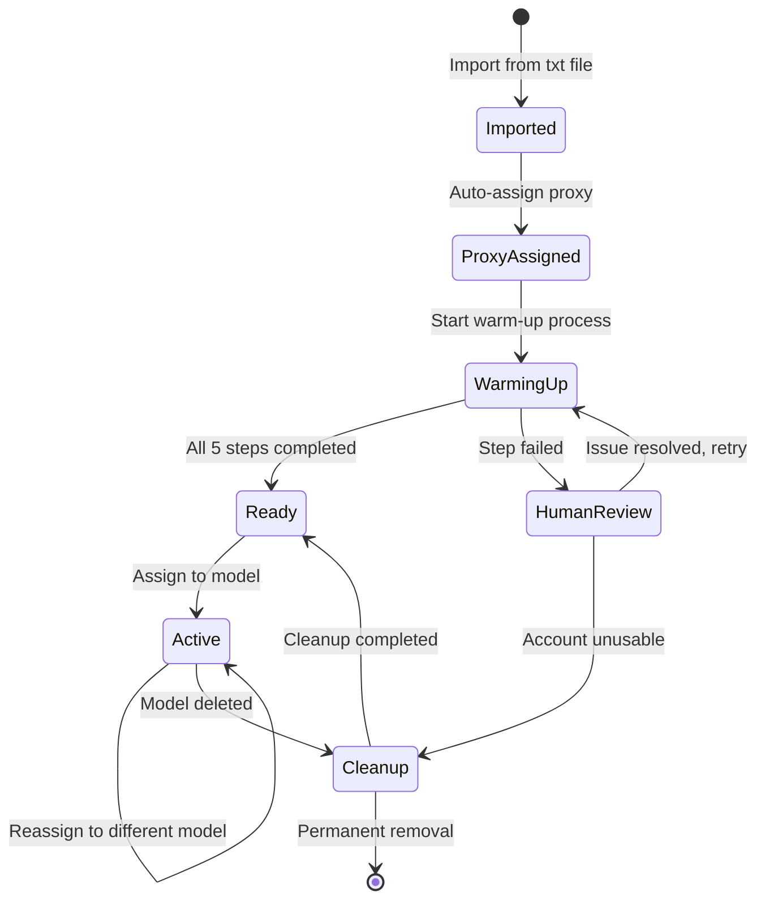

# Account Lifecycle State Machine

## Overview
Comprehensive documentation of the Instagram account lifecycle management system, including all possible states, transitions, triggers, and business rules that govern account progression through the automation platform.

## **State Definitions**

### **1. Imported** 
**Initial state for newly imported accounts**
- **Description**: Account just imported from txt file, basic validation completed
- **Characteristics**:
  - Has username, email, password
  - No proxy assigned yet
  - No warm-up process started
  - Not yet validated for Instagram compatibility
- **Duration**: Typically seconds to minutes
- **Next State**: `proxy_assigned` (automatic)

### **2. Proxy Assigned**
**Account has proxy assigned and ready for warm-up**
- **Description**: Available proxy automatically assigned, ready to begin warm-up
- **Characteristics**:
  - Has valid proxy connection (IP, port, credentials)
  - Proxy capacity verified (not exceeding 3 accounts)
  - Account credentials validated
  - Ready to start 5-day warm-up process
- **Duration**: Usually immediate, can be delayed if no proxies available
- **Next State**: `warming_up` (automatic scheduling)

### **3. Warming Up**
**Account progressing through 5-day warm-up process**
- **Description**: Bot executing daily warm-up steps over 5 calendar days
- **Characteristics**:
  - Current step (1-5) tracked in `warmup_step` field
  - Each step has 24-hour minimum intervals
  - Step progress logged in `warmup_step_logs` table
  - Bot assignments tracked per step
- **Step Sequence**:
  1. **Day 1**: Change profile picture
  2. **Day 2**: Change bio
  3. **Day 3**: Post a highlight
  4. **Day 4**: Post a story  
  5. **Day 5**: Post a post
- **Duration**: Exactly 5 calendar days (120 hours minimum)
- **Next States**: `ready` (success) or `human_review` (failure)

### **4. Human Review Needed**
**Account requires manual intervention due to failed steps**
- **Description**: One or more warm-up steps failed, requiring human analysis
- **Characteristics**:
  - Detailed error logs available in `warmup_step_logs`
  - Step that failed identified with error message
  - Bot ID that encountered the error recorded
  - Manual review required before proceeding
- **Common Causes**:
  - Instagram blocking/rate limiting
  - Account temporarily suspended
  - Proxy connection issues
  - Content policy violations
- **Duration**: Indefinite until human intervention
- **Next States**: `warming_up` (retry after fix) or `cleanup` (account unusable)

### **5. Ready/Available**
**Account completed warm-up, available for model assignment**
- **Description**: Successfully completed all 5 warm-up steps, ready for campaigns
- **Characteristics**:
  - All warm-up steps completed successfully
  - Instagram profile properly configured
  - Account "aged" and appears natural
  - Available for assignment to any model
- **Duration**: Indefinite until assigned to model
- **Next State**: `active` (model assignment)

### **6. Active in Model**
**Account actively assigned to model and executing campaign**
- **Description**: Account assigned to specific model, executing campaign strategy
- **Characteristics**:
  - Assigned to specific model with defined strategy
  - Following model's posting schedule and content
  - Bot executing daily campaign actions
  - Performance metrics being tracked
- **Duration**: Ongoing until reassigned or model deleted
- **Next States**: `active` (different model) or `cleanup` (model deletion)

### **7. Cleanup Required**
**Account needs profile reset before reuse**
- **Description**: Model deleted or account reassigned, needs complete profile reset
- **Characteristics**:
  - All posts need to be deleted
  - Profile picture reset to default
  - Bio cleared or reset
  - Account history cleaned
- **Cleanup Process**:
  1. Delete all Instagram posts
  2. Reset profile picture to default/blank
  3. Clear bio content
  4. Remove highlights
  5. Clear story highlights
- **Duration**: 1-2 days depending on content volume
- **Next State**: `ready` (after successful cleanup)

## **State Transition Diagram**



## **Transition Rules**

### **Automatic Transitions**

#### **Imported → Proxy Assigned**
- **Trigger**: Immediately after successful import
- **Conditions**: 
  - Account passed basic validation
  - At least one proxy available with capacity
- **Process**:
  1. Find first available proxy (account_count < 3)
  2. Assign proxy to account
  3. Update proxy.account_count
  4. Set account.proxy_assigned_at timestamp
- **Failure Handling**: Account stays in `imported` until proxy available

#### **Proxy Assigned → Warming Up**
- **Trigger**: Scheduled daily process (e.g., 9 AM daily)
- **Conditions**:
  - Proxy assignment successful
  - Account in queue for warm-up start
- **Process**:
  1. Set account.warmup_started_at
  2. Set account.warmup_step = 1
  3. Create first step log entry
  4. Add to bot task queue

#### **Warming Up → Ready**
- **Trigger**: Completion of step 5
- **Conditions**:
  - All 5 steps completed successfully
  - Each step status = 'completed'
  - No pending failures
- **Process**:
  1. Set account.warmup_completed_at
  2. Clear account.warmup_step (set to null)
  3. Update lifecycle_state to 'ready'
  4. Log state transition

### **Conditional Transitions**

#### **Warming Up → Human Review**
- **Trigger**: Step failure with retry limit exceeded
- **Conditions**:
  - Step failed after maximum retries (default: 3)
  - Error requires human intervention
- **Process**:
  1. Set account.requires_human_review = true
  2. Set account.last_error_message
  3. Create detailed error log
  4. Notify administrators

#### **Human Review → Warming Up**
- **Trigger**: Manual human action
- **Conditions**:
  - Human reviewed and resolved issue
  - Account deemed recoverable
- **Process**:
  1. Clear account.requires_human_review
  2. Reset retry counters
  3. Resume from failed step or restart sequence

#### **Active → Cleanup**
- **Trigger**: Model deletion or forced reassignment
- **Conditions**:
  - Model being deleted has assigned accounts
  - Manual account reassignment requiring cleanup
- **Process**:
  1. Queue all model posts for deletion
  2. Schedule profile reset tasks
  3. Clear model assignment
  4. Set cleanup timeline

## **State Persistence**

### **Database Fields**
```sql
-- Primary state tracking
lifecycle_state VARCHAR(20) NOT NULL DEFAULT 'imported'
warmup_step INTEGER NULL CHECK (warmup_step BETWEEN 1 AND 5)

-- Timeline tracking
warmup_started_at TIMESTAMP NULL
warmup_completed_at TIMESTAMP NULL
assigned_to_model_at TIMESTAMP NULL

-- Error handling
requires_human_review BOOLEAN DEFAULT FALSE
last_error_message TEXT NULL
last_error_at TIMESTAMP NULL
retry_count INTEGER DEFAULT 0

-- Bot tracking
last_bot_action_by VARCHAR(50) NULL
last_bot_action_at TIMESTAMP NULL
```

### **State History Logging**
Every state transition is logged in `account_state_history`:
```sql
INSERT INTO account_state_history (
  account_id, from_state, to_state, transition_reason, 
  triggered_by, bot_id, metadata, created_at
) VALUES (
  101, 'warming_up', 'ready', 'warmup_completed',
  'bot', 'bot_001', '{"completed_steps": [1,2,3,4,5]}', NOW()
);
```

## **Warm-up Process Detailed Rules**

### **Step Timing Requirements**
- **Minimum Interval**: 24 hours between steps
- **Maximum Interval**: 48 hours between steps (avoid looking inactive)
- **Optimal Timing**: Random between 20-28 hours
- **Daily Schedule**: Steps executed between 9 AM - 9 PM local time

### **Step Dependencies**
1. **Step 1 (Profile Picture)**: No dependencies
2. **Step 2 (Bio)**: Must complete Step 1 first
3. **Step 3 (Highlight)**: Must complete Steps 1-2 first
4. **Step 4 (Story)**: Must complete Steps 1-3 first
5. **Step 5 (Post)**: Must complete Steps 1-4 first

### **Content Assignment Rules**
- **Profile Pictures**: Assigned from model content type 'pfp' or 'any'
- **Bio Text**: Assigned from text_pools content type 'bio'
- **Highlight Content**: Images from 'highlight' or 'any', text from 'highlight'
- **Story Content**: Images from 'story' or 'any', text from 'story'
- **Post Content**: Images from 'post' or 'any', text from 'post'

### **Failure Handling**
```javascript
// Retry logic for failed steps
const retryStep = async (accountId, stepNumber) => {
  const account = await getAccount(accountId);
  
  if (account.retry_count >= MAX_RETRIES) {
    await transitionToHumanReview(accountId, 'max_retries_exceeded');
    return;
  }
  
  await incrementRetryCount(accountId);
  await scheduleStepRetry(accountId, stepNumber, calculateBackoffDelay());
};
```

## **Performance Metrics**

### **State Distribution Tracking**
Monitor account distribution across states:
```sql
SELECT 
  lifecycle_state,
  COUNT(*) as account_count,
  ROUND(COUNT(*) * 100.0 / SUM(COUNT(*)) OVER(), 2) as percentage
FROM accounts 
GROUP BY lifecycle_state;
```

### **Warm-up Success Rates**
Track completion rates per step:
```sql
SELECT 
  step_number,
  COUNT(CASE WHEN status = 'completed' THEN 1 END) as completed,
  COUNT(CASE WHEN status = 'failed' THEN 1 END) as failed,
  ROUND(
    COUNT(CASE WHEN status = 'completed' THEN 1 END) * 100.0 / 
    COUNT(*), 2
  ) as success_rate
FROM warmup_step_logs 
GROUP BY step_number;
```

### **Average Processing Times**
```sql
SELECT 
  lifecycle_state,
  AVG(EXTRACT(EPOCH FROM (updated_at - created_at))/3600) as avg_hours_in_state
FROM account_state_history 
GROUP BY lifecycle_state;
```

## **Business Rules**

### **Proxy Management**
- Maximum 3 accounts per proxy (hard limit)
- Proxy assignment is first-available basis
- Failed proxy connections trigger proxy health check
- Accounts can be manually reassigned to different proxies

### **Model Assignment**
- Accounts can only be assigned to one model at a time
- Model deletion triggers automatic cleanup for all assigned accounts
- Account reassignment requires cleanup if previous model had significant activity

### **Content Usage**
- Content is consumed from shared pools
- Template content can be reused across models
- Content usage is tracked for analytics
- Failed content (causing step failures) is flagged for review

### **Error Escalation**
1. **Immediate Retry**: Network/connection errors
2. **Delayed Retry**: Rate limiting errors (wait specified time)
3. **Human Review**: Policy violations, account suspensions
4. **Permanent Failure**: Account banned, proxy blacklisted

## **Monitoring and Alerts**

### **Critical Alerts**
- **High Failure Rate**: >20% of warm-up steps failing
- **Proxy Issues**: Proxy unavailable affecting multiple accounts
- **Human Review Backlog**: >50 accounts waiting for review
- **State Transition Errors**: Accounts stuck in invalid states

### **Performance Alerts**
- **Slow Processing**: Accounts taking >48 hours per warm-up step
- **Content Depletion**: Content pools running low for active models
- **Capacity Issues**: All proxies at maximum capacity

### **Daily Reports**
- Account state distribution
- Warm-up completion rates
- Human review queue status
- Proxy utilization rates
- Bot performance metrics 